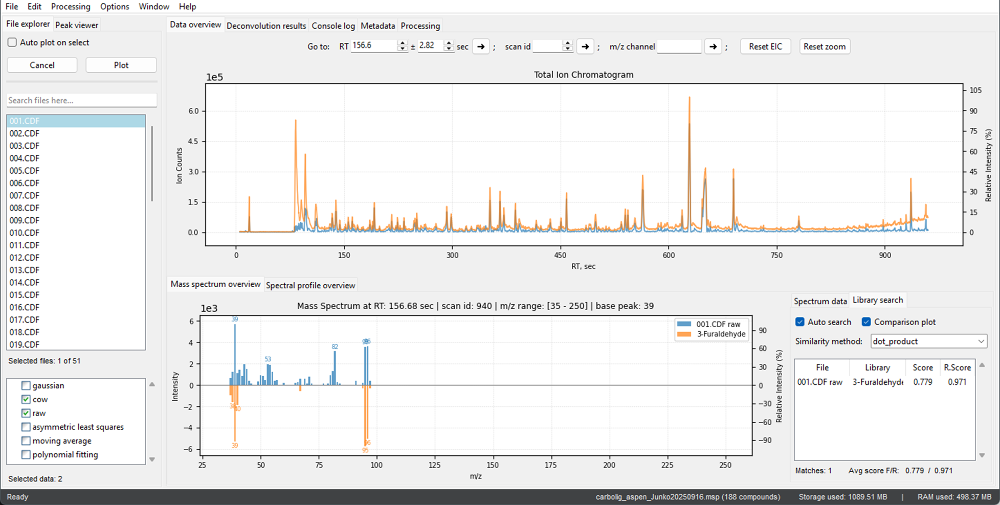

<strong><a href="quick_start.md">Download Pyromix for Windows x64</a></strong>

  

# Pyromix Introduction

Pyromix is fast and robust software for processing, visualization and results in validation of Pyrolysis gas chromatography mass spectrometry (Py-GC-MS) raw files. Pyromix is designed to simplify and accelerate the analysis of Py-GC-MS data for solid samples (for example wood and peat). It manages a significant bottleneck in data processing, which traditionally requires extensive expert knowledge and can take hours to complete. By providing a user-friendly interface, the software automates and speeds up this process, making it accessible to non-experts, including researchers, foresters, and agronomists.

> **Note:** If you use Pyromix in your research, please remember to cite the appropriate reference:  
> [PLACE A REFERENCE HERE]  
>  
> Your citation helps support the development and acknowledges the work behind Pyromix!

<strong>Get started quickly - visit the <a href="#/quick_start.md">Quick Start</a> page</strong>

   

  

# Core functionality & benefits

Pyromix’s core function is high-performance deconvolution, which can separate complex chemical mixtures in a matter of minutes. This ability to quickly identify and reveal hidden compounds is crucial for high-throughput analysis, allowing for the rapid screening of a large number of samples. This transforms a labor-intensive and expert-dependent process into a fast, accessible tool.

A key feature is the ability for users to process raw data step-by-step, providing them with complete control and a clear understanding of the analytical workflow. At each stage, users can visually assess the quality of the processing, ensuring data integrity and accuracy. For example, after denoising or baseline correction, users can see the "before" and "after" views of their chromatograms, allowing for immediate quality checks.

For each processing step—including denoising, baseline correction, sample alignment, deconvolution, and annotation—the software offers several methods for the user to choose from. This flexibility allows users to select the optimal algorithm for their specific data type or research question. 
> To enhance performance, the application is designed to utilize 100% of a PC’s resources through multiprocessing, significantly speeding up batch processing tasks. Users can easily set up and save the optimal settings for each method, streamlining future analyses.

