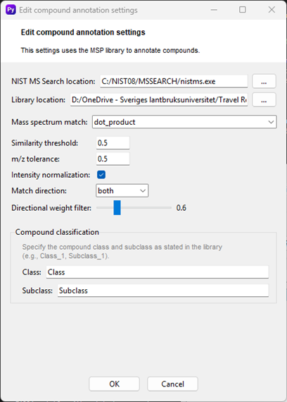

# Annotation
The **Edit compound annotation settings** window is a crucial part of the workflow, as it allows you to configure how the software identifies and names the compounds in your data. This process is based on comparing the mass spectra of your unknown compounds with a library of known compounds, specifically using a NIST Mass Spectral Library file (`.msp`).

## How to Use
- **NIST MS Search Location**: optionally you can specify the location of the NIST MS Search executable (nistms.exe) on your computer. This program is a prerequisite for the annotation process for a quick annotation shown in the Data overview tab to annotate non-deconvoluted chromatographic peaks. It is also can be used to verify annotation processing results in the Deconvolution results tab for deconvoluted peaks. Click the **[...]** button to browse to and select the file.
- **Library Location**: you have to point the software to your spectral library. This is the `.msp` file that contains the mass spectra of the compounds you want to use for identification. Click the **[...]** button next to Library location to select your library file.
- **Mass Spectrum Match**: This dropdown menu allows you to choose the algorithm used to compare your experimental mass spectra to the library spectra. The default option is dot_product, a widely used method for spectral matching. Alternative options are Pearson correlation, Neutral loss.
- **Similarity Threshold**: This value determines how similar a compound's mass spectrum must be to a library spectrum to be considered a match. The value ranges from 0 to 1, with 1 being a perfect match. A higher threshold will result in fewer but more confident annotations. The default value is 0.5.
- **m/z Tolerance**: This setting specifies the acceptable difference in the mass-to-charge ratio (m/z) for a peak to be considered a match between your data and the library. A smaller tolerance results in a stricter match.
- **Intensity Normalization**: The checkbox for Intensity normalization ensures that the intensity values of both the experimental and library spectra are scaled to a common range before comparison. This helps to improve the accuracy of the similarity calculation in case of not normalized library data.
- **Match Direction**: You can specify the direction of the mass spectrum match: `forward`, `reverse`, or `both`. Recommended using method both.
    - **Forward** matches your experimental spectrum against the library spectrum.
    - **Reverse** matches the library spectrum against your experimental spectrum.
    - **Both** provides the most comprehensive result by performing both comparisons.

- **Directional Weight Filter**: This slider and the corresponding value allow you to adjust the weighting of the forward and reverse match directions, giving you fine-grained control over the final match score. 
> The directional weight is a powerful tool for fine-tuning the balance between the forward and reverse matches. A value of 1 is a good default, while values greater than 1 can be used to apply a stricter penalty for extra peaks in your unknown spectrum. Please see the section [Directional Weight](directional_weight.md) and its Effect on Scoring.

- **Compound Classification**: The two text fields at the bottom, `Class` and `Subclass`, are used for classifying the annotated compounds. You can specify a custom class and subclass based on the information available in your MSP library, which helps in organizing your final results. Open your MSP library in the text editor to figure out the class and subclass notation. Using default MSP library, it refers to `Class` and `Subclass` notations.

After adjusting the settings to your preference, click **OK** to apply the changes and close the window, or **Cancel** to discard them.

    

