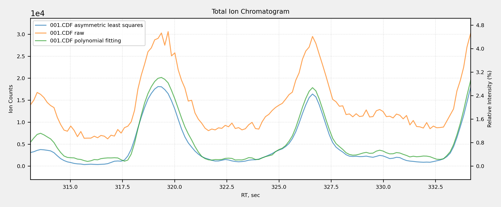
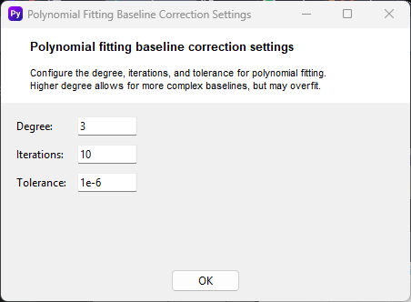
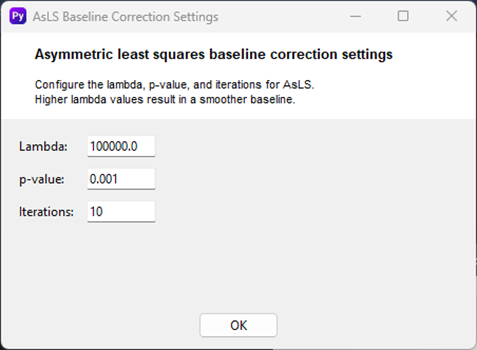

# Baseline correction

     
    

Baseline correction is used to remove background signals or drift from chromatographic data, ensuring that detected peaks accurately represent the compounds of interest rather than noise or systematic variations. This improves the reliability and accuracy of quantitative and qualitative analysis.
 
On the chromatogram, different baseline correction methods  applied to the raw data, such as polynomial fitting and asymmetric least squares.

## Polynomial Fitting Baseline Correction Settings
The "Polynomial Fitting Baseline Correction Settings" window is a tool for removing the background signal from your chromatogram, a process known as baseline correction. This is a crucial step to ensure that the detected peaks represent the actual compounds and not the underlying noise or drift. This window allows you to configure the parameters for the polynomial fitting method, which models the baseline as a polynomial curve and subtracts it from the data.

     
    

### Usage
- **Degree**: This value specifies the degree of the polynomial that will be used to fit the baseline. A higher degree allows for a more complex curve, which can be useful for correcting intricate baselines but carries the risk of overfitting, where the curve starts to fit the peaks as well. A lower degree creates a simpler, smoother curve.
- **Iterations**: This setting determines the number of times the algorithm will iterate to find the best fit for the polynomial curve. More iterations can lead to a more accurate baseline correction but will also increase processing time.
- **Tolerance**: This value specifies the threshold for convergence. The algorithm will stop iterating when the change in the fit between successive iterations falls below this tolerance value. A smaller tolerance will result in a more precise fit.
- After adjusting these settings, click **OK** to apply the changes and proceed with the baseline correction, or **Cancel** to exit without saving your changes.

## Asymmetric Least Squares Baseline Correction Settings
The "Asymmetric least squares baseline correction settings" window allows you to configure a powerful algorithm for removing background noise and correcting the baseline of your chromatograms. Unlike polynomial fitting, this method is particularly effective for data with uneven baselines or broad, unresolved peaks.

     
    

### Usage
- **Lambda (λ)**: This value controls the smoothness of the fitted baseline. Higher λ values result in a smoother baseline, which is useful for data with high-frequency noise. However, setting it too high can cause the algorithm to over-smooth and potentially remove some of the actual signal from your peaks.
- **p-value (p)**: The p-value controls the asymmetry of the algorithm. It is a value between 0 and 1. The closer the value is to 0, the more asymmetrical the correction, meaning it will be more focused on fitting the baseline and less on fitting the peaks. The closer it is to 1, the more symmetrical it becomes. For most baseline correction purposes, a small p-value is recommended.
- **Iterations**: This setting determines the number of times the algorithm will iterate to find the optimal baseline fit. A higher number of iterations can lead to a more accurate result but will increase processing time.
- After adjusting these settings, click **OK** to apply the changes and proceed with the baseline correction, or **Cancel** to exit without saving your changes.

