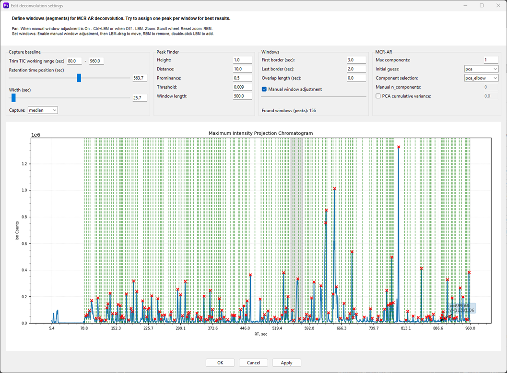

# Deconvolution
## Edit Deconvolution Settings
The **Edit deconvolution settings** window is a sophisticated and the most complex tool that allows you to configure the parameters for the deconvolution process, which separates co-eluting compounds in your data. It's designed to give you precise control over how Pyromix identifies and isolates individual peaks, a critical step for accurate analysis. The main part of the window is a visual display of the **Maximum Intensity Projection Chromatogram**, which shows all the peaks detected in your sample. This is an optional editing step and can be skipped. Otherwise, peaks and consequent windows will be detected automatically. 

### Usage
This allows you to define the "windows" or segments where deconvolution will be performed. The goal is to isolate each peak within its own window. Ideally, each peak should be in its own window to ensure the best results. However, it's also possible to have several peaks within a single window, especially when using deconvolution methods like MCR-AR. This allows Pyromix to resolve complex co-eluted mixtures as well as compounds that elute at different times within each window.
To perform proper deconvolution, you should find a balance between the window length and the max number of components or cumulative explained variance. Setting a window that is too long with a limited number of components might cause some compounds to be lost. You can also adjust windows manually by double-clicking on the chromatogram to add or remove them as well as adding a new one.
1. **Capture Baseline**
The **Capture baseline** section is used to prepare your data for peak detection. By defining a working range and a capture method, you can effectively separate the actual signal (peaks) from the baseline noise, which is a necessary step before the peak finder can accurately identify compounds.
- **Trim TIC working range (sec)**: This slider lets you define the specific retention time range you want to focus on for deconvolution, effectively trimming out irrelevant parts of the chromatogram.
- **Capture**: The dropdown menu allows you to choose the method for baseline capture, with options such as median.
2. **Peak Finder**
This section is where you configure the algorithm for detecting peaks in the chromatogram.
- **Height**: Sets the minimum intensity for a peak to be considered.
- **Distance**: Specifies the minimum retention time difference between two adjacent peaks.
- **Prominance**: A value that filters peaks based on their prominence relative to the surrounding noise.
- **Threshold**: A value used to filter out peaks below a certain intensity threshold.
- **Window length**: Defines the width of the window used to search for peaks.
3. **Windows**
- **First border (sec)**: Sets the starting point for the first deconvolution window.
- **Last border (sec)**: Sets the end point for the last deconvolution window.
- **Overlap length (sec)**: Controls the amount of overlap between adjacent windows.
- **Manual window adjustment**:
    - **Pan**: Use `Ctrl + LBM` (Left Button Mouse) and drag to move the chromatogram view.
    - **Zoom**: Use `Ctrl + LBM` drag to zoom in on a specific area. Use the mouse scroll wheel to zoom in or out. `Right-click RBM` to reset the zoom.
    - **Add/Remove Windows**: `Double-click` on the chromatogram with the left mouse button to add a manual window. `Double-click` again to remove it. You can also drag the window borders to adjust their size.
4. **MCR-AR**
This is where you set the parameters for the Multivariate Curve Resolution-Alternating Regression (MCR-AR) deconvolution algorithm.
- **Max components**: Sets the maximum number of components the algorithm should try to resolve within a window.
- **Initial guess**: Choose the initial guess method for the deconvolution algorithm.
- **Component selection**: Select the method for selecting the number of components, such as `PCA` or `shifted_gaussian`.
- **Manual n_components**: Allows you to manually specify the number of components if you're not using an Component selection: manual selection method.
- **PCA cumulative variance**: Sets the minimum cumulative variance for PCA components to be included. Enabled if `pca_elbow` smethod is used in Component selection.

Once you have adjusted all the settings, click **Apply** to see the changes reflected in the chromatogram or **OK** to save the settings and exit the window. Click **Cancel** to exit without saving your changes.

!> **Note**: The deconvolution step is a mandatory part of the processing pipeline, as the data produced by this step is a required input for the subsequent annotation step. Therefore, you cannot skip this step entirely. However, if your data does not contain co-eluting compounds or if you prefer to bypass the full deconvolution algorithm, you can still process your data through the deconvolution module. To do this, you must set the `Maximum components = 1` in the **Edit deconvolution settings** window. Alternatively use `Compound section > manual`; `Manual n_components > 1`. This will ensure that the data is correctly prepared for the annotation phase without performing a complex, multi-component deconvolution.

    

