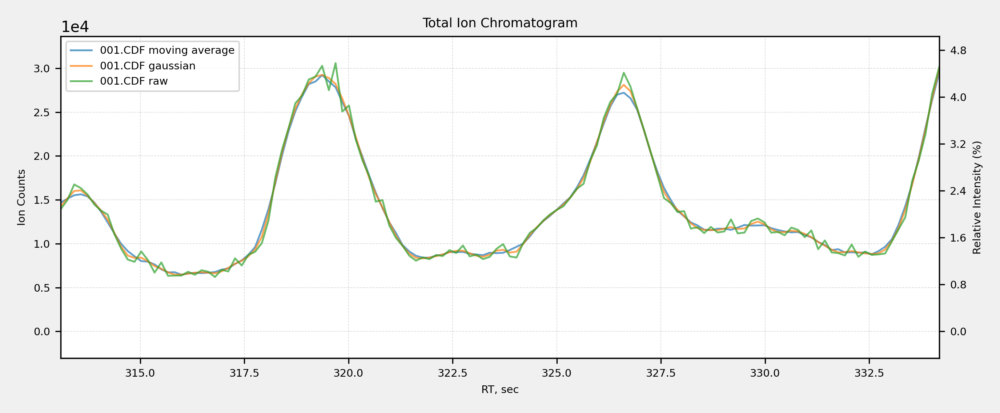

# Denoising

     
    

Denoising is used to improve the quality of experimental data by reducing random noise that can obscure meaningful patterns or features. In analytical techniques such as chromatography, noise can make it difficult to accurately identify and quantify peaks, leading to unreliable results. By applying smoothing filters you can enhance signal clarity.
 
The chromatogram plot presented here demonstrates the effects of different denoising methods applied to raw data. By comparing the original signal with results from various smoothing techniques, you can observe how each method reduces noise and enhances peak clarity.

## Gaussian Smooth Settings
The **Gaussian Smooth Settings** window allows you to configure a smoothing filter that can be used to reduce high-frequency noise in your data. This is a common preprocessing step that can improve the quality of your chromatograms, making it easier to detect and resolve peaks. The filter works by applying a Gaussian function to the data, effectively averaging out sudden changes and creating a smoother curve.

     
    

### Usage
- **Window size (odd number)**: This value specifies the size of the smoothing window. The window must be an odd number. A larger window size will result in more aggressive smoothing, which can be useful for removing significant noise but may also cause a loss of resolution for sharp peaks.
- **Sigma (σ)**: This value controls the standard deviation of the Gaussian curve. Sigma determines the spread of the smoothing function. A larger sigma value will increase the smoothing effect, while a smaller value will make it more localized.
- After adjusting the settings to your preference, click **OK** to apply the changes and proceed, or **Cancel** to exit without making any changes.

## Moving Average Smooth Settings
The **Moving Average Smooth Settings** window allows you to configure a simple but effective smoothing filter. This method reduces noise by calculating the average of a specified number of data points within a defined window and then replacing the central point with that average. This process is repeated across the entire chromatogram, resulting in a smoother curve that is easier to analyze.

     
    

### Usage
- **Window size (odd number)**: This value defines the number of data points to include in the moving average calculation. You must enter an odd number. A larger window size will increase the smoothing effect, which can be useful for removing significant noise but may also blur sharp peaks.
- Click **OK** to apply the settings and proceed, or **Cancel** to exit without making any changes.

