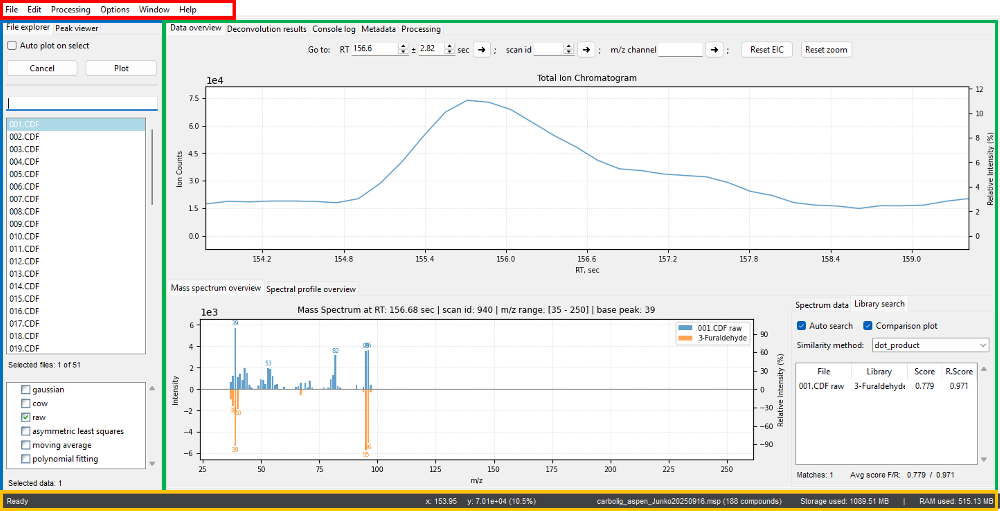
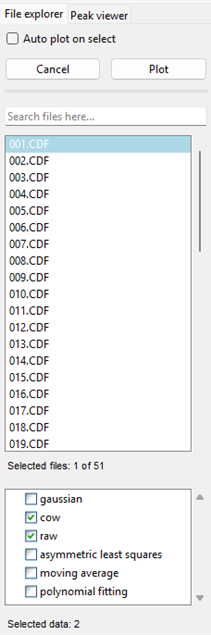
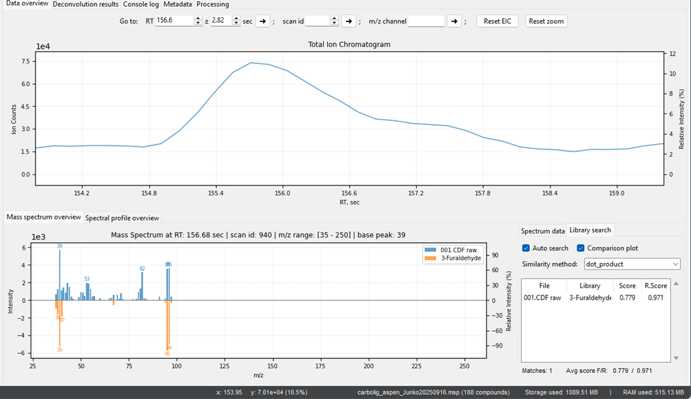
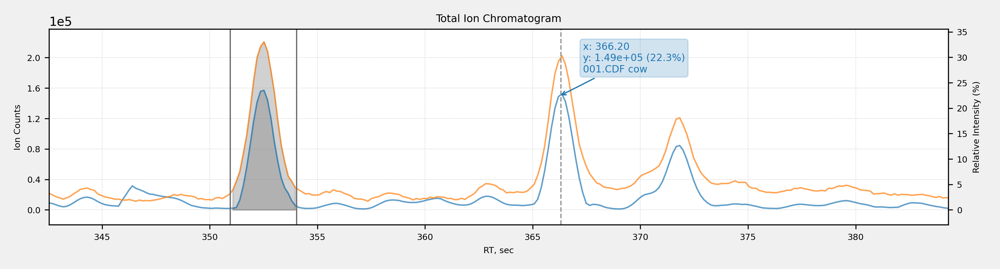
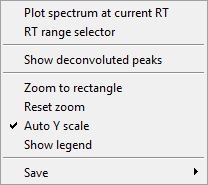
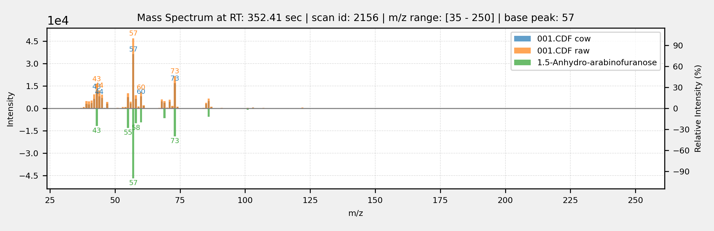
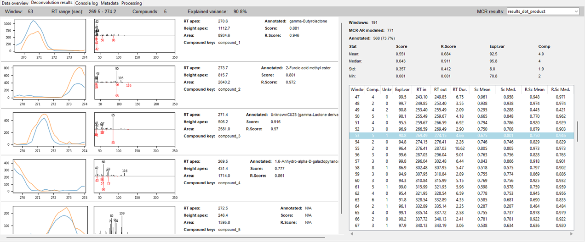
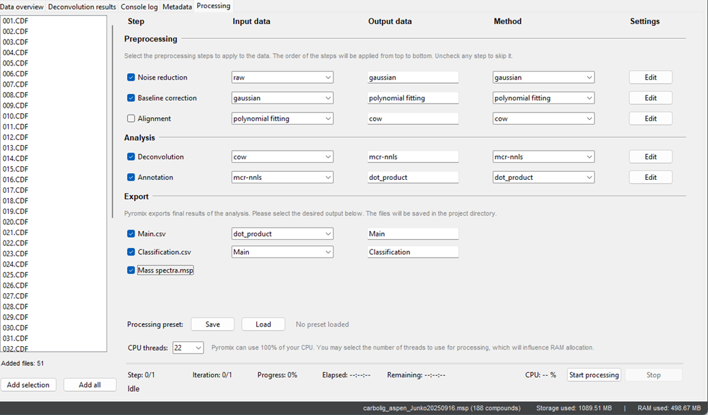

# Main window
Pyromix's GUI is designed with a clear, logical layout to ensure a smooth and efficient workflow. It is composed of four main elements: the **Menu bar**, the **Sidebar**, the **Main area**, and the **Status bar**. Each element has its own right mouse click context menu that contains plenty of different useful options. Try it.
- **Menu bar (red)**: Located at the very top of the application window, the Menu Bar provides access to core functions such as `File` (for opening, saving, and managing projects, etc.), `Edit`, `Processing`, `View`, etc.
- **Sidebar (blue)**: Positioned on the left side of the window, the **Sidebar** is a dynamic panel that serves as your primary navigation tool for the project's data files. It contains the [File explorer](#file-explorer-tab) and [Peak viewer](#peak-viewer-tab) tabs, allowing you to easily browse files, select data to plot, and manage your processing queues.
- **Main area (green)**: This central and largest part of the window is where all the main processing and visualization takes place. It is organized into a series of tabs that correspond to different stages of the workflow, such as [Data overview](#data-overview-tab), [Deconvolution results](#deconvolution-results-tab), **Console log**, **Metadata**, and [Processing](#processing).
- **Status bar (yellow)**:Located at the bottom of the window, the **Status bar** provides real-time feedback on Pyromix's status. It displays important information like memory consumption, the current processing status, and the number of threads being utilized. This gives you a quick overview of the application's performance and resource usage.

    

<!-- ---------------------------- -->

---

# Sidebar

    

## File explorer tab

The **File explorer** tab is your primary tool for managing the raw data files in your project. It provides a simple, list-based view of all the files you have loaded, and allows you to select files for both plotting and processing.

## Usage

The main panel of the file explorer displays a list of all the .`cdf` files in your project. The `Auto plot on select` option, located at the top of the window, allows you to automatically plot the selected file in the main **Data overview** tab. 

?> `Auto plot on select` feature can be resource-intensive, so it is recommended to keep it disabled for better performance, especially when working with large datasets. 

You can still select and plot files manually by holding **Ctrl** or **Shift** to select multiple files and then clicking the **Plot** button. These same selections can be used when adding files to the processing queue.

The bottom window of the tab shows the available data to plot. A new dataset is added to this list every time a new processing step produces a corresponding data file. This allows you to easily switch between viewing the raw data and the processed data at different stages of your analysis or compare raw data with the data after each processing step. 

---

 

    

## Peak viewer tab

**Peak viewer** tab shows the list of peaks detected after Deconvolution settings adjusted for the current project. By clicking an item in the window list, it will plot total ion chromatogram and mass spectrum plots in the **Data overview** tab as well as perform the library search. “RT (sec)” column indicates the center of the window, but not the center of the peak; “Window (sec)” column indicates length of corresponding window. The context menu that appears when you right-click on the list that allows you to refresh the table and to export the data to `.csv` file. 

<!-- ---------------------------- -->

---

# Main area

## Data overview tab

The **Data Overview** tab serves as the central hub for visualizing and interacting with your processed data. It provides a comprehensive view of your chromatograms, mass spectra, and the results of your analysis. The window is divided into three main sections: the **Total Ion Chromatogram (TIC)**, the **Mass Spectrum Overview**, and the **Spectrum Data Library Search**.
  

    

### Total Ion Chromatogram (TIC)

The top-right section displays the **Total Ion Chromatogram** of the selected sample. This is the main graphical representation of your data, showing ion counts as a function of retention time. You can:
- **Navigate**: Use the mouse to pan and zoom in on specific regions of the chromatogram to inspect individual peaks.
- **Inspect Peaks**: Use the `Go to:` function to quickly jump to a specific retention time or scan ID. Plot Extracted Ion Chromatogram by setting up specified mass to charge channel.  

    

#### Chromatogram Context Menu

The context menu that appears when you right-click on a chromatogram plot provides a set of powerful, quick-access options for interacting with your data. It allows you to perform key visualization and analysis tasks without needing to navigate through the main menu bar.

    

- **Plot spectrum at current RT**: This option quickly displays the mass spectrum for the specific retention time (RT) you right-clicked on. This is a crucial function for immediately inspecting the ionic composition of a peak.
- **RT range selector**: This tool allows you to select a specific retention time range on the chromatogram, which is particularly useful plotting an integrated area mass spectrum. 
- **Show deconvoluted peaks**: This option heading to the **Deconvolution results** tab, allowing you to visually assess the results of your deconvolution process spectrum for the specific retention time (RT) you right-clicked on.
- **Zoom to rectangle**: This function enables you to draw a rectangle on the plot to zoom in on a specific region.
- **Reset zoom**: This option quickly resets the plot to its original zoom level, showing the full chromatogram.
- **Auto Y scale**: This is a toggleable option that automatically adjusts the y-axis to fit the data currently being displayed, preventing peaks from being cut off.
- **Show legend**: This option toggles the visibility of the plot legend.
- **Save**: The Save submenu provides various options for exporting the plot, including saving it as an image file or `.csv` table.

### Mass spectrum overview

The bottom-left section shows the **Mass Spectrum** at a specific retention time. This spectrum represents the abundance of different ions at that point in the chromatogram. This tab is particularly useful for verifying the presence of specific ions and for manually inspecting the data for quality control purposes. It gives you the raw numbers behind the visual plots in the **Data overview** tab.

    

     
    

#### Spectrum Data

- **RT (Retention Time) and Scan**: At the top of the window, you'll see the exact retention time and scan number corresponding to the mass spectrum you are currently viewing. This helps you to pinpoint the location of the data in your chromatogram.
- **Select**: The dropdown menu allows you to switch between different processing levels of the data, such as the raw data or a processed version. This is useful for comparing the effect of a specific preprocessing step on the mass spectrum.
- **Table of Values**: The main body of the window displays a table with three columns:
    - **m/z**: The mass-to-charge ratio of the ion.
    - **Intensity, %:** The relative intensity of the ion, normalized to the most abundant ion in the spectrum (100%).
    - **Intensity**: The absolute intensity (ion counts) of the ion.
- **Data Summary**: At the bottom, you'll find a summary of the spectrum, including the total number of signals and the sum of all intensities, which provides a quick overview of the spectrum's complexity and abundance.

The context menu appears when you right-click on **Spectrum Data**.
- **Select all / Unselect all**: This option selects / unselects all of the signals of the mass spectrum. 
- **Copy to clipboard**: This function copies the selected signals to the clipboard in a tabular format, which can then be pasted into a spreadsheet or another application for further analysis.
- **Save to CSV**: This option allows you to export the selected data to a `.csv` file. This is a convenient way to store your annotation results for later use.
- **Save to MSP**: This option allows you to save the mass spectra of the selected compounds to a `.msp` file. This can be useful for creating your own custom spectral libraries. Keep in mind this data might be overlapped peaks of co-eluted compounds. There is a clever way to save a pure deconvoluted spectrum to MSP file in the Deconvolution results tab. 
- **Send to NIST MS Search**: This is a powerful feature that sends the mass spectrum of the selected compound directly to the NIST MS Search program for in-depth analysis and identification.

### Spectrum Data Library Search

     
    

The bottom-right section provides the results of the library search for compound annotation.
- **Search Results**: It lists potential compound matches from your spectral library, along with their score and R.Score (reverse score).
- **Visualize Matches**: The "**Compare plot**" option allows you to visually compare your experimental spectrum with the top library match, giving you a quick visual confirmation of the match quality. You can see how the peaks in your data align with the peaks of the library compound.

!> To be able to use these features, you should set up an MSP library path. See the [Annotation](annotation.md) section.

The right mouse click shows a context menu. Below there are some of the options.
- **Copy to clipboard**: This function copies the selected peak data to the clipboard in a tabular format, which can then be pasted into a spreadsheet or another application for further analysis.
- **Save to CSV**: This option allows you to export the selected peak data directly to a `.csv` file, providing a convenient way to store your results for later use.
- **Send to NIST MS Search**: This is a powerful feature that sends the mass spectrum of the selected peak directly to the NIST MS Search program for in-depth analysis and identification. 
- **Reload Library**: This option reloads the spectral library, which sometimes is useful if you have made changes to the library file while Pyromix is running.
- **Library Info**: This option provides information about the currently loaded spectral library, such as the number of compounds it contains.

> To be able to send it to NIST MS Search you need to specify executable software file. Please see the [Annotation](annotation.md) section on how to do it.

<!-- ---------------------------- -->

---

## Deconvolution results tab
The **Deconvolution Results** tab is where you can visually inspect and interact with the results of the deconvolution and annotation steps. It provides a detailed, side-by-side comparison of the raw data with the resolved compounds, giving you a clear picture of the algorithm's performance.

### Usage
The main area is divided into two sections.

#### Left Section: Visual Compound Overview
This section provides a visual summary of the identified compounds. Each row represents a single compound, showing:
- **Elution Profile**: A plot showing the elution profile of the resolved for selected samples.
- **Mass Spectrum**: A bar chart of the compound's deconvoluted mass spectrum, with its key peaks labeled with their m/z values.
- **Information Panel**: A text panel with key metrics for the compound, including its retention time (RT), height, area, score and the R.Score (reverse score) from the library search, along with the name of the annotated compound.

#### Right Section (Sidebar): MCR Results
This section provides a tabular view of the results from the Multivariate Curve Resolution (MCR) algorithm and the library search.
- **Info panel**: It shows the total number of windows used in deconvolution, number of resolver components and the number of annotated compounds. Below there is a table of a brief deconvolution and annotation statistics. 
- **MCR Results list**: The table lists of windows. This gives you a numerical assessment of the deconvolution and annotation quality for each window.

    

<!-- ---------------------------- -->

---

## Processing tab
The **Processing** tab is the heart of the Pyromix analytical capabilities. It provides a visual and interactive interface where you can configure every step of the data analysis workflow. Divided into logical sections for **Preprocessing**, **Analysis**, and **Export**, it allows you to select from various methods for tasks such as noise reduction, baseline correction, alignment, deconvolution, and annotation. After each step, a new dataset is produced, named after the method used, but you have the flexibility to give it a custom name. This granular control over input and output data allows for maximum flexibility. For example, you can process your raw data through a denoising step, and then use the denoised data as the input for the next step, baseline correction. Pyromix also allows you to run steps multiple times or even skip them entirely by unchecking them, enabling you to create complex, multi-pass processing loops. You can also monitor the progress of your analysis in real-time and even save your preferred settings for future projects, making it easy to replicate successful workflows.

### Export section
The Export section is the final step in your data processing workflow, allowing you to generate and save the results of your analysis in various file formats.
#### Usage

?> To export your data, simply check the box next to the desired file type and click `Start processing`. The exported files will be saved in your project directory.

The export options are designed to provide flexibility, allowing you to save your data in a format that suits your needs. The Export section consists of three main file types:
- `Main.csv`: This will export a single `.csv` file containing a data table of all the key information from your analysis, including the, area, compound names, window, scores and other relevant metrics for each identified compound for each sample used in the processing. You can choose the input data for this export from the dropdown menu, allowing you to export results from any stage of your workflow.
- `Classification.csv`: This option exports a `.csv` file that summarizes percentage ratio of compounds classes and subclasses. This is the main export option for a quick overview of the different classes of compounds identified in your samples.
- `Mass spectra.msp`: This option allows you to export the deconvoluted mass spectra of your identified compounds into an `.msp` file, which is a format compatible with NIST Mass Spectral Libraries. This is a valuable feature for creating your own custom libraries or to verify the results with NISM MS Search in a batch way.

!> The export of `Main.csv` is only possible after **Annotation** has been performed. Similarly, `Classification.csv` cannot be exported if no `Main.csv` has been produced.

> **Tip:** You can specify input and output custom names in the corresponding entries. Moreover you can  specify existing file or data name that has not been produced witihin the current processing run.

### Processing presets
Once you have configured a processing workflow that works well for your data, you can save your custom settings as a preset for future use. Look for the **Save** button located just above the CPU threads settings. Clicking **Save** will allow you to name and store your current configuration. When you want to reuse these settings for a new batch of samples, simply click the Load button next to it and select your saved preset. This feature is a great way to maintain consistency and efficiency across multiple projects.

 
### CPU threading
Pyromix powerful performance is due to its intelligent use of your computer's resources. In the **Processing** tab, you'll notice an option to adjust the number of **CPU threads**. This setting allows you to control how many of your PC's CPU cores are dedicated to the analysis, enabling Pyromix to utilize up to 100% of your machine's processing power. For computationally intensive tasks, increasing the number of threads can significantly reduce processing time.
A crucial point to remember is that increasing the number of threads also increases memory consumption. It is important to be cautious with this setting to avoid performance issues. Pyromix has been tested to run smoothly when utilizing **22 cores and 32 GB of RAM**. In such a scenario, processing CDF files with a m/z range of 35−250 and a retention time of 960 seconds consumed a maximum of 18 GB of RAM and takes in total around 10 minutes. You can adjust this setting based on your system's capabilities and the complexity of your dataset, ensuring a smooth and efficient workflow. By default, it uses all available CPU threads.

    

