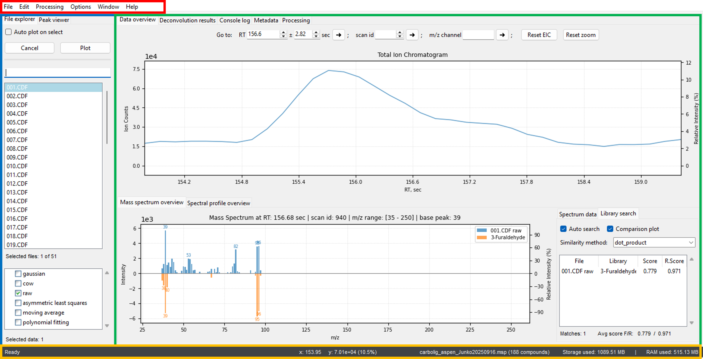

# Main window
Pyromix's GUI is designed with a clear, logical layout to ensure a smooth and efficient workflow. It is composed of four main elements: the **Menu bar**, the **Sidebar**, the **Main area**, and the **Status bar**. Each element has its own right mouse click context menu that contains plenty of different useful options. Try it.
- **Menu bar (red)**: Located at the very top of the application window, the Menu Bar provides access to core functions such as `File` (for opening, saving, and managing projects, etc), `Edit`, `Processing`, `View`etc.
- **Sidebar (blue)**: Positioned on the left side of the window, the **Sidebar** is a dynamic panel that serves as your primary navigation tool for the project's data files. It contains the [File explorer](tab_file_explorer.md) and [Peak Viewer](tab_peak_viewer.md) tabs, allowing you to easily browse files, select data to plot, and manage your processing queues.
- **Main area (green)**: This central and largest part of the window is where all the main processing and visualization takes place. It is organized into a series of tabs that correspond to different stages of the workflow, such as [Data overview](tab_data_overview.md), [Deconvolution results](tab_deconvolution.md), **Console log**, **Metadata**, and [Processing](tab_processing.md).
- **Status bar (yellow)**: Located at the bottom of the window, the **Status bar** provides real-time feedback on Pyromix's status. It displays important information like memory consumption, the current processing status, and the number of threads being utilized. This gives you a quick overview of the application's performance and resource usage.

    

