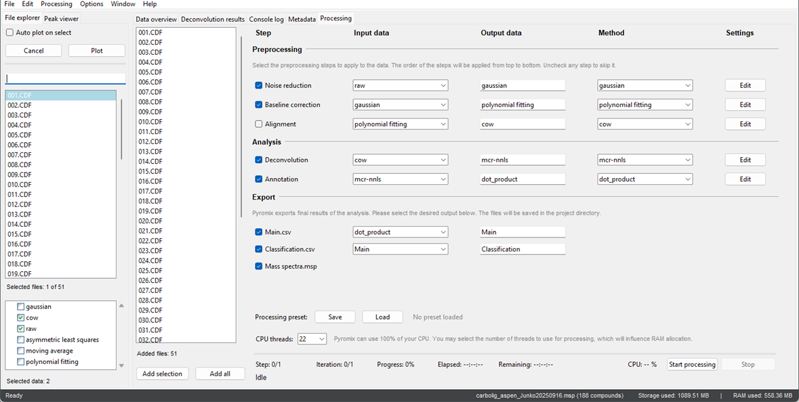

# Download
The software is available for free download from this website. We provide dedicated installers for Windows.

    <a href="https://docsify.js.org/" target="_blank" style="font-size:1.4em;">
        <strong>Download Pyromix here :arrow_down_small:</strong>
    </a>
    </a>

# Install
Installation is a straightforward process. Simply download the installer for your operating system and follow the on-screen instructions. The software is designed to be lightweight and has no dependencies, allowing for a quick and seamless installation. Once installed, you can launch the application and begin analyzing your data immediately.

# Start processing

To begin processing your data, you'll first need to load your raw .cdf files into the software. You can do this in one of two ways:
1. Navigate to the menu bar at the top of the application and select `File > Open files`.
2. Alternatively, in the [File explorer tab](tab_file_explorer.md) on the left, right-click and choose `Open files`.
3. It will take some time to complete, as Pyromix caches the `.cdf` files to its project folder.

After selecting your project files, go to the [Processing tab](tab_processing.md). You can then add all files to the processing queue by clicking the `Add all` button, or select specific files in the [File explorer tab](tab_file_explorer.md) and click `Add selection`. For a quick standard run, we recommend keeping the default settings. For advanced users, Pyromix offers the ability to investigate files and fine-tune processing settings for more precise control over the analysis. Once your files are in the queue, click `Start processing` to begin the automated analysis. Once processing is complete, Pyromix will automatically save the output data to the [project folder](project_settings.md). To quickly open the [results](results.md) in the project folder, go to `File > Open project folder`.

?> **Remember** to [save the project](project_settings.md) to your chosen directory.

?> **Note:** Pyromix does not modify your original `.cdf` files. Instead, it creates a local copy of the files within its [project folder](project_settings.md), where all processing and changes are applied. This ensures the integrity of your raw data, leaving your original files untouched.

    

*Figure: The main interface of Pyromix, showing processing controls.*

<strong>Enjoy the results</strong>

