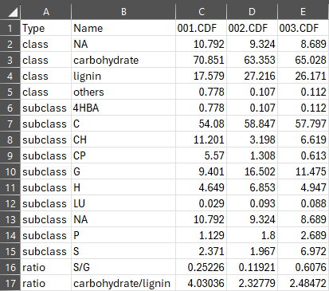
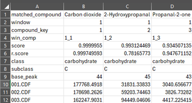
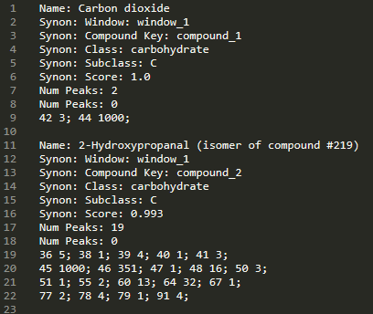

# Results

        <em>Example output images generated by Pyromix after the analysis workflow.</em>
    

    
    

        <em>Figure 1. Main.csv</em>
    

    
    

        <em>Figure 2. Classification.csv</em>
    

    
    

        <em>Figure 3. Mass Spectra.msp</em>
    

> Pyromix provides options for exporting your processed data and analysis results, allowing you to save key information in widely-used file formats. Exported results stored in the project folder.

### Main.csv
- `Main.csv`: This file contains the primary results of your analysis (Figure 1). 

### Classification.csv
- `Classification.csv`: This file provides a summary of the compound classifications (Figure 2).

### Mass Spectra.msp
- `Mass Spectra.msp`: This option allows you to export deconvoluted mass spectra to a .msp file. This format is compatible with NIST Mass Spectral Libraries, enabling you to create your own custom libraries from the high-quality, pure compound spectra resolved by the software (Figure 3).