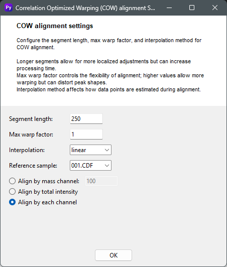

# Sample alignment
## COW Alignment Settings
The **Correlation Optimized Warping (COW) alignment settings** window is used to configure the parameters for the COW alignment method, which corrects for small shifts in retention time between different samples. This is a crucial preprocessing step to ensure that corresponding peaks in different chromatograms align correctly, making them comparable for subsequent analysis.

### Usage
- **Segment length**: This value defines the size of the segments that the algorithm will use to perform localized adjustments. Longer segments allow for more localized adjustments but can increase processing time.
- **Max warp factor**: This setting controls the flexibility of the alignment. Higher values allow for more "warping" or stretching of the chromatogram to align peaks, but be cautious as this can also distort the natural peak shapes.
- **Interpolation**: This dropdown menu lets you select the method used to estimate data points during alignment. Linear interpolation is often a good starting point, as it provides a balance between accuracy and computational speed.
- **Reference sample**: You should select one of your samples to serve as the reference against which all other samples will be aligned. Choose a sample with well-defined peaks and a representative profile for best results.
- **Alignment Method**: You can select from three different alignment methods:
    - **Align by mass channel**: Aligns the chromatograms based on a specific mass-to-charge (m/z) channel. This is useful when you have a key compound or a specific fragment ion you want to use for alignment.
    - **Align by total intensity**: Aligns the chromatograms based on their total intensity. This is a good general-purpose method for most datasets.
    - **Align by each channel**: This option performs alignment on a per-channel basis. It's the most comprehensive method and is recommended for complex mixtures where different compounds might be present in different channels.
- After setting all the parameters to your liking, click **OK** to apply the settings and proceed with the alignment, or **Cancel** to exit without making any changes.

    

