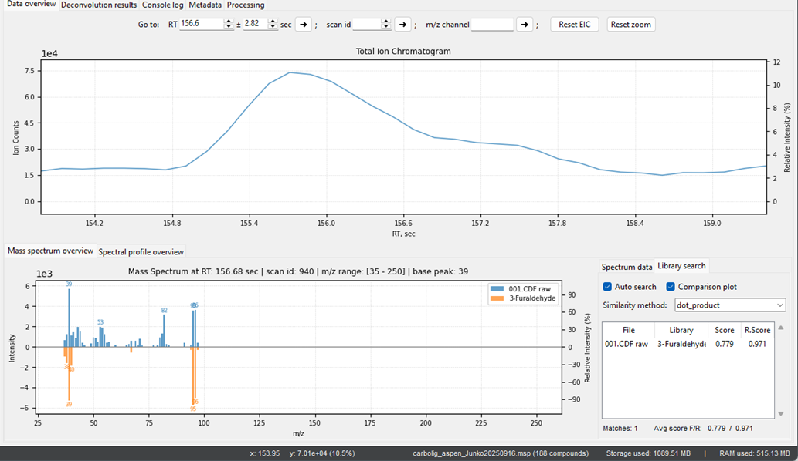
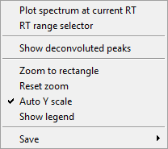
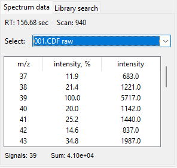
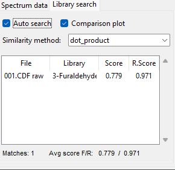

# Data overview tab

The **Data Overview** tab serves as the central hub for visualizing and interacting with your processed data. It provides a comprehensive view of your chromatograms, mass spectra, and the results of your analysis. The window is divided into three main sections: the **Total Ion Chromatogram (TIC)**, the **Mass Spectrum Overview**, and the **Spectrum Data Library Search**.
  

    

## Total Ion Chromatogram (TIC)

The top-right section displays the **Total Ion Chromatogram** of the selected sample. This is the main graphical representation of your data, showing ion counts as a function of retention time. You can:
- **Navigate**: Use the mouse to pan and zoom in on specific regions of the chromatogram to inspect individual peaks.
- **Inspect Peaks**: Use the `Go to:` function to quickly jump to a specific retention time or scan ID. Plot Extracted Ion Chromatogram by setting up specified mass to charge channel.  

### Chromatogram Context Menu

The context menu that appears when you right-click on a chromatogram plot provides a set of powerful, quick-access options for interacting with your data. It allows you to perform key visualization and analysis tasks without needing to navigate through the main menu bar.
- **Plot spectrum at current RT**: This option quickly displays the mass spectrum for the specific retention time (RT) you right-clicked on. This is a crucial function for immediately inspecting the ionic composition of a peak.
- **RT range selector**: This tool allows you to select a specific retention time range on the chromatogram, which is particularly useful plotting an integrated area mass spectrum. 
- **Show deconvoluted peaks**: This option heading to the **Deconvolution results** tab, allowing you to visually assess the results of your deconvolution process spectrum for the specific retention time (RT) you right-clicked on.
- **Zoom to rectangle**: This function enables you to draw a rectangle on the plot to zoom in on a specific region.
- **Reset zoom**: This option quickly resets the plot to its original zoom level, showing the full chromatogram.
- **Auto Y scale**: This is a toggleable option that automatically adjusts the y-axis to fit the data currently being displayed, preventing peaks from being cut off.
- **Show legend**: This option toggles the visibility of the plot legend.
- **Save**: The Save submenu provides various options for exporting the plot, including saving it as an image file or `.csv` table.

    

## Mass spectrum overview

The bottom-left section shows the **Mass Spectrum** at a specific retention time. This spectrum represents the abundance of different ions at that point in the chromatogram. This tab is particularly useful for verifying the presence of specific ions and for manually inspecting the data for quality control purposes. It gives you the raw numbers behind the visual plots in the **Data overview** tab.

### Spectrum Data

- **RT (Retention Time) and Scan**: At the top of the window, you'll see the exact retention time and scan number corresponding to the mass spectrum you are currently viewing. This helps you to pinpoint the location of the data in your chromatogram.
- **Select**: The dropdown menu allows you to switch between different processing levels of the data, such as the raw data or a processed version. This is useful for comparing the effect of a specific preprocessing step on the mass spectrum.
- **Table of Values**: The main body of the window displays a table with three columns:
    - **m/z**: The mass-to-charge ratio of the ion.
    - **Intensity, %:** The relative intensity of the ion, normalized to the most abundant ion in the spectrum (100%).
    - **Intensity**: The absolute intensity (ion counts) of the ion.
- **Data Summary**: At the bottom, you'll find a summary of the spectrum, including the total number of signals and the sum of all intensities, which provides a quick overview of the spectrum's complexity and abundance.

    

The context menu appears when you right-click on **Spectrum Data**.
- **Select all / Unselect all**: This option selects / unselects all of the signals of the mass spectrum. 
- **Copy to clipboard**: This function copies the selected signals to the clipboard in a tabular format, which can then be pasted into a spreadsheet or another application for further analysis.
- **Save to CSV**: This option allows you to export the selected data to a `.csv` file. This is a convenient way to store your annotation results for later use.
- **Save to MSP**: This option allows you to save the mass spectra of the selected compounds to a `.msp` file. This can be useful for creating your own custom spectral libraries. Keep in mind this data might be overlapped peaks of co-eluted compounds. There is a clever way to save a pure deconvoluted spectrum to MSP file in the Deconvolution results tab. 
- **Send to NIST MS Search**: This is a powerful feature that sends the mass spectrum of the selected compound directly to the NIST MS Search program for in-depth analysis and identification.

### Spectrum Data Library Search
The bottom-right section provides the results of the library search for compound annotation.
- **Search Results**: It lists potential compound matches from your spectral library, along with their score and R.Score (reverse score).
- **Visualize Matches**: The "**Compare plot**" option allows you to visually compare your experimental spectrum with the top library match, giving you a quick visual confirmation of the match quality. You can see how the peaks in your data align with the peaks of the library compound.

    

> To be able to use these settings, you should set up an MSP library path. See the [Annotation](annotation.md) section.

The right mouse click shows a context menu. Below there are some of the options.
- **Copy to clipboard**: This function copies the selected peak data to the clipboard in a tabular format, which can then be pasted into a spreadsheet or another application for further analysis.
- **Save to CSV**: This option allows you to export the selected peak data directly to a `.csv` file, providing a convenient way to store your results for later use.
- **Send to NIST MS Search**: This is a powerful feature that sends the mass spectrum of the selected peak directly to the NIST MS Search program for in-depth analysis and identification. 
- **Reload Library**: This option reloads the spectral library, which sometimes is useful if you have made changes to the library file while Pyromix is running.
- **Library Info**: This option provides information about the currently loaded spectral library, such as the number of compounds it contains.

> To be able to send it to NIST MS Search you need to specify executable software file. Please see the [Annotation](annotation.md) section on how to do it.