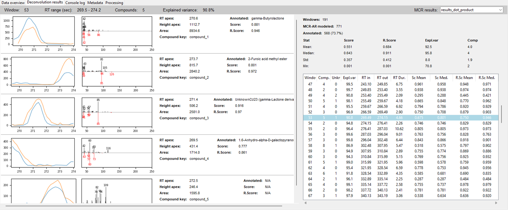

# Deconvolution results tab
The **Deconvolution Results** tab is where you can visually inspect and interact with the results of the deconvolution and annotation steps. It provides a detailed, side-by-side comparison of the raw data with the resolved compounds, giving you a clear picture of the algorithm's performance.

## Usage
The main area is divided into two sections.

### Left Section: Visual Compound Overview
This section provides a visual summary of the identified compounds. Each row represents a single compound, showing:
- **Elution Profile**: A plot showing the elution profile of the resolved for selected samples.
- **Mass Spectrum**: A bar chart of the compound's deconvoluted mass spectrum, with its key peaks labeled with their m/z values.
- **Information Panel**: A text panel with key metrics for the compound, including its retention time (RT), height, area, score and the R.Score (reverse score) from the library search, along with the name of the annotated compound.

### Right Section (Sidebar): MCR Results
This section provides a tabular view of the results from the Multivariate Curve Resolution (MCR) algorithm and the library search.
- **Info panel**: It shows the total number of windows used in deconvolution, number of resolver components and the number of annotated compounds. Below there is a table of a brief deconvolution and annotation statistics. 
- **MCR Results list**: The table lists of windows. This gives you a numerical assessment of the deconvolution and annotation quality for each window.

    

