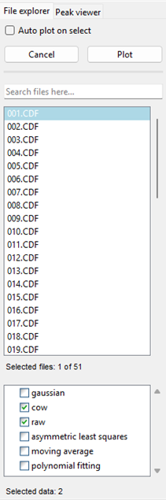

    

# File explorer tab

The **File explorer** tab is your primary tool for managing the raw data files in your project. It provides a simple, list-based view of all the files you have loaded, and allows you to select files for both plotting and processing.

## How to Use

The main panel of the file explorer displays a list of all the .`cdf` files in your project. The `Auto plot on select` option, located at the top of the window, allows you to automatically plot the selected file in the main **Data overview** tab. 

> `Auto plot on select` feature can be resource-intensive, so it is recommended to keep it disabled for better performance, especially when working with large datasets. 

You can still select and plot files manually by holding **Ctrl** or **Shift** to select multiple files and then clicking the **Plot** button. These same selections can be used when adding files to the processing queue.

The bottom window of the tab shows the available data to plot. A new dataset is added to this list every time a new processing step produces a corresponding data file. This allows you to easily switch between viewing the raw data and the processed data at different stages of your analysis or compare raw data with the data after each processing step. 

