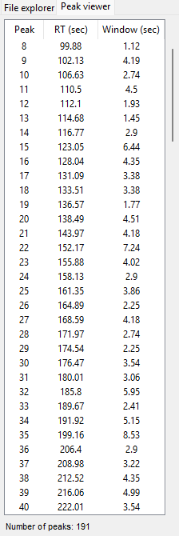

    

# Peak viewer tab

**Peak viewer** tab shows the list of peaks detected after Deconvolution settings adjusted for the current project. By clicking an item in the window list, it will plot total ion chromatogram and mass spectrum plots in the **Data overview** tab as well as perform the library search. “RT (sec)” column indicates the center of the window, but not the center of the peak; “Window (sec)” column indicates length of corresponding window. The context menu that appears when you right-click on the list that allows you to refresh the table and to export the data to `.csv` file. 