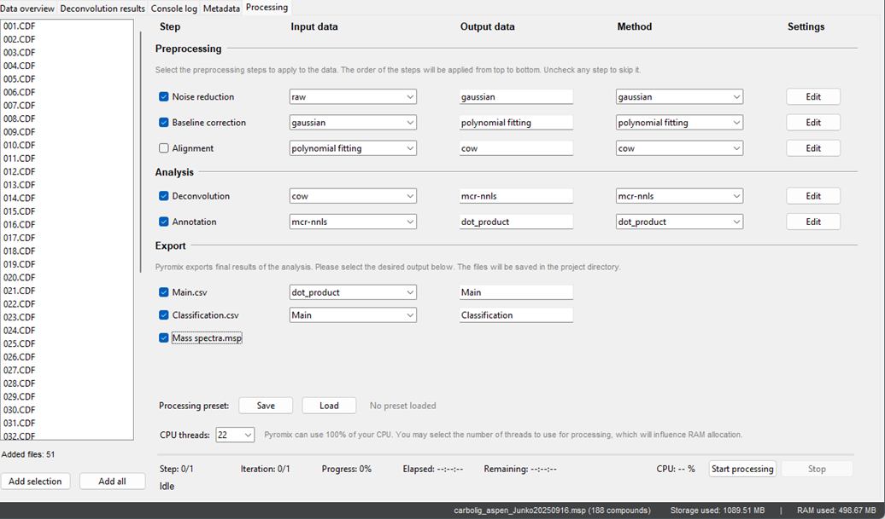

# Processing tab
The **Processing** tab is the heart of the Pyromix analytical capabilities. It provides a visual and interactive interface where you can configure every step of the data analysis workflow. Divided into logical sections for **Preprocessing**, **Analysis**, and **Export**, it allows you to select from various methods for tasks such as noise reduction, baseline correction, alignment, deconvolution, and annotation. After each step, a new dataset is produced, named after the method used, but you have the flexibility to give it a custom name. This granular control over input and output data allows for maximum flexibility. For example, you can process your raw data through a denoising step, and then use the denoised data as the input for the next step, baseline correction. The software also allows you to run steps multiple times or even skip them entirely by unchecking them, enabling you to create complex, multi-pass processing loops. You can also monitor the progress of your analysis in real-time and even save your preferred settings for future projects, making it easy to replicate successful workflows.

## Export section
The Export section is the final step in your data processing workflow, allowing you to generate and save the results of your analysis in various file formats.
### How to Use
The export options are designed to provide flexibility, allowing you to save your data in a format that suits your needs. The Export section consists of three main file types:
- `Main.csv`: This will export a single `.csv` file containing a data table of all the key information from your analysis, including the, area, compound names, window, scores and other relevant metrics for each identified compound for each sample used in the processing. You can choose the input data for this export from the dropdown menu, allowing you to export results from any stage of your workflow.
- `Classification.csv`: This option exports a `.csv` file that summarizes percentage ratio of compounds classes and subclasses. This is the main export option for a quick overview of the different classes of compounds identified in your samples.
- `Mass spectra.msp`: This option allows you to export the deconvoluted mass spectra of your identified compounds into an `.msp` file, which is a format compatible with NIST Mass Spectral Libraries. This is a valuable feature for creating your own custom libraries or to verify the results with NISM MS Search in a batch way.

> To export your data, simply check the box next to the desired file type and click Start processing. The exported files will be saved in your project directory.

## Processing presets
Once you have configured a processing workflow that works well for your data, you can save your custom settings as a preset for future use. Look for the **Save** button located just above the CPU threads settings. Clicking **Save** will allow you to name and store your current configuration. When you want to reuse these settings for a new batch of samples, simply click the Load button next to it and select your saved preset. This feature is a great way to maintain consistency and efficiency across multiple projects.

 
## CPU threading
Pyromix powerful performance is due to its intelligent use of your computer's resources. In the **Processing** tab, you'll notice an option to adjust the number of **CPU threads**. This setting allows you to control how many of your PC's CPU cores are dedicated to the analysis, enabling the software to utilize up to 100% of your machine's processing power. For computationally intensive tasks, increasing the number of threads can significantly reduce processing time.
A crucial point to remember is that increasing the number of threads also increases memory consumption. It is important to be cautious with this setting to avoid performance issues. The software has been tested to run smoothly when utilizing **22 cores and 32 GB of RAM**. In such a scenario, processing CDF files with a m/z range of 35−250 and a retention time of 960 seconds consumed a maximum of 18 GB of RAM and takes in total around 10 minutes. You can adjust this setting based on your system's capabilities and the complexity of your dataset, ensuring a smooth and efficient workflow. By default, it uses all available CPU threads.

    

